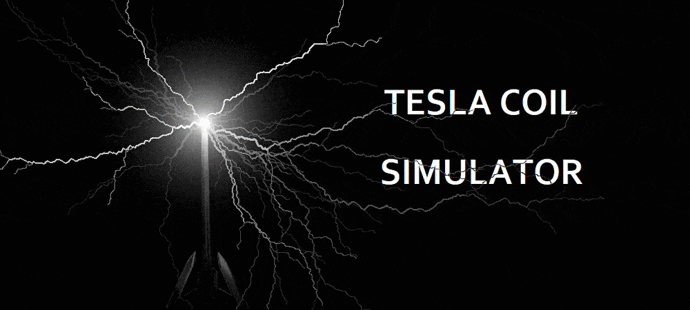

# Interactive Tesla Coil Simulator
Procedurally generated bolts of lightning that follow the cursor.



## General info
This program simulates a Tesla coil.

You can customize the lightning with sliders, controlling its strength, frequency, number of branches and more.
	
## Setup
```
git clone https://github.com/ChaseLean/tesla-coil-simulator
```

